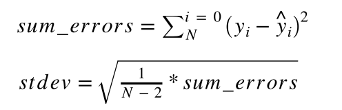

# Time-Series Analysis Glossary
Quick Time-Series Analysis Glossary for Reference (all in README.md)

## Contribute!
Fork and make PR if you want to add a critical term to this glossary.

Based on
- https://towardsdatascience.com/machine-learning-part-19-time-series-and-autoregressive-integrated-moving-average-model-arima-c1005347b0d7
- https://machinelearningmastery.com/time-series-forecast-uncertainty-using-confidence-intervals-python/

## Visualization
https://lewiserick.github.io/time-series-analysis-glossary/

## Time-Series Analysis
Method to understand or forecast data points measured in a period of time (seconds, days, etc.), a time series.

## Stationary
✅ The variable is not a function of time

✅ The rolling mean doesn't change over time

✅ The rolling standard deviation doesn't change over time (homoscedasticity)

✅ The covariance between the ith and (i+m)th term in series isn't a function of time

✅ Augmented Dickey-Fuller Test

## Converting Series to Stationary
✅ Log

✅ Exponential Decay

✅ Subtract rolling mean

✅ Time shifting: subtract every point by its previous one

## AR (AutoRegressive Model)
Assumes that a value in the series is dependent by its previous values.

## MA (Moving Average Model)
Assumes that a value in the series is dependent by the error noise of its previous values.

## ARIMA (AutoRegressive Integrative Moving Average Model)
AR + MA

Three integers (p, d, q) are typically used to parametrize ARIMA models.
- p: number of autoregressive terms (AR order)
  
  Can be calculated using **Auto Correlation Function (ACF)**, which calculates correlation between current and previous items
- d: number of nonseasonal differences (differencing order)
  
  Usually 1 is what is mostly used

- q: number of moving-average terms (MA order)

  Can be calculated using the Partial **Auto Correlation Function (PACF)**, which calculates the correlation between observations made at two points in time while accounting for any influence from other data points.
  
## Prediction Intervals (PI)
- PI = prediction ± z-score * stderr

### Uncertainty

For measuring uncertainty, the z-score parameter is required. The z-score determines the prediction interval coverage.
- median -> ± 0 standard deviations
The intuition behind the median is that it splits the population evenly into two parts. As such, the z-score at 0 marks this point.
- 50% -> ± 0.675 standard deviations
- 67% -> ± 1 standard deviations
- 95% -> ± 1.96 standard deviations
- 99% -> ± 2.326 standard deviations

### Standard Error for Linear Regression

## Contribute!
Fork and make PR if you want to add a critical term to this glossary.
